# YTber
Create your own Android application of your Web Site/YouTube Channel within a few minutes. you just need to have a mobile responsive website to create a web-view application of that.

`` কয়েক মিনিটের মধ্যে আপনার ওয়েব সাইট/ইউটিউব চ্যানেলের আপনার নিজস্ব অ্যান্ড্রয়েড অ্যাপ্লিকেশন তৈরি করুন। এটির একটি ওয়েব-ভিউ অ্যাপ্লিকেশন তৈরি করতে আপনার কেবল একটি মোবাইল প্রতিক্রিয়াশীল ওয়েবসাইট থাকতে হবে। ``

> Price `` $8 USD Only ``

# Features
* WebView / YouTube
* Easy integration.
* Flash Screen.
* Pull Down to Refresh.
* HTML 5, JS support.
* view and copy link.
* Open in browser.
* Files Download Support.
* Custom Alert on No Internect Connection.

# Requirements
```
1. Android Studio Latest Version.
2. Mobile Responsive Website.
3. Basic Knowledge about Android Studio
```

# Screenshot
| | | |
|:-------------------------:|:-------------------------:|:-------------------------:|
| 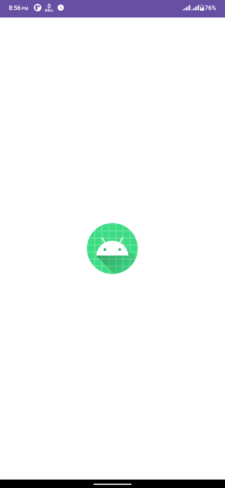 |  |  |
| 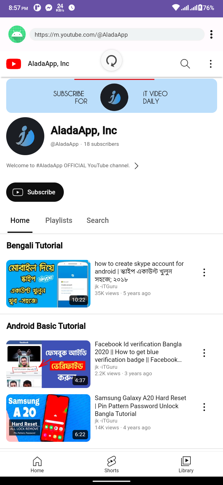 | 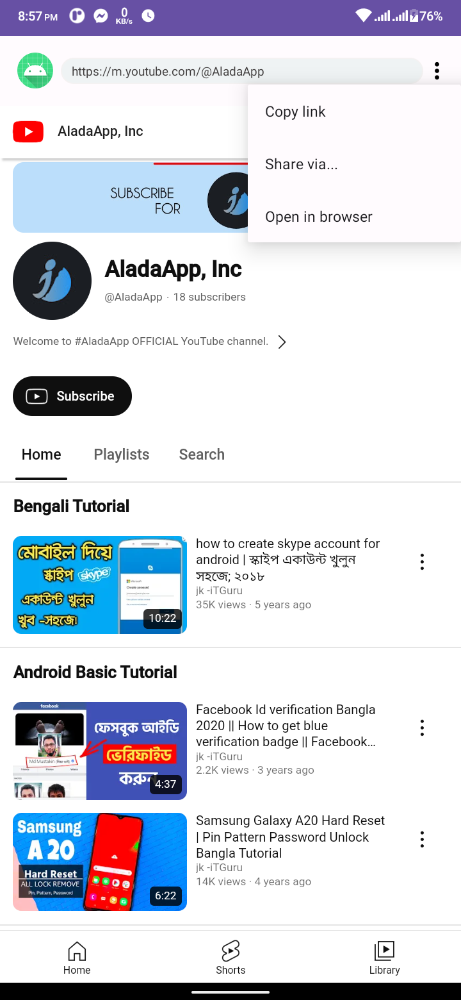 | 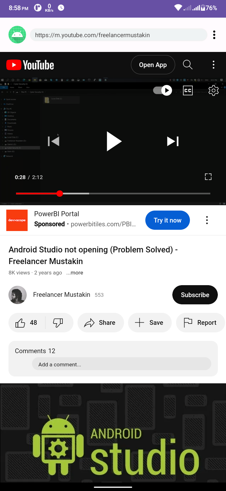 |
| | 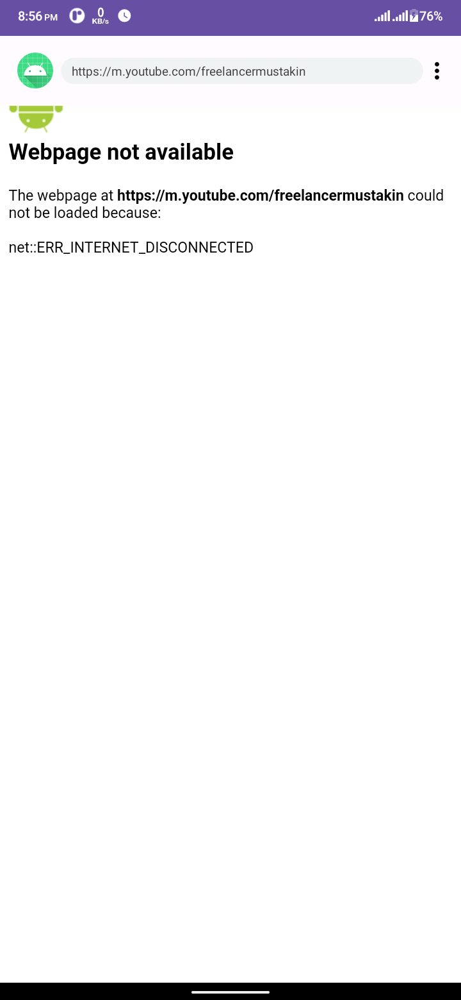 | |

# Change log
| Version 1.0                          |
| ----------------------------- |
| Released Date: 13 Jan 2024                  |
| #Initial Release                  |

| | | | | |
|:-------------------------:|:-------------------------:|:-------------------------:|:-------------------------:|:-------------------------:|
| 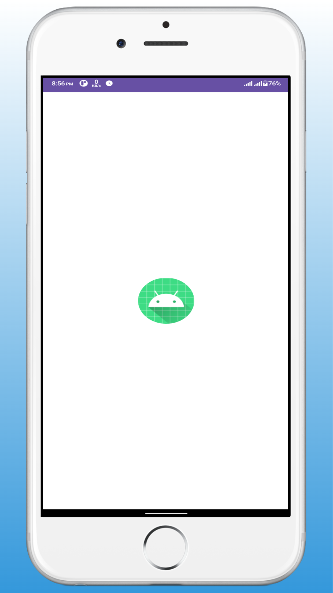 | 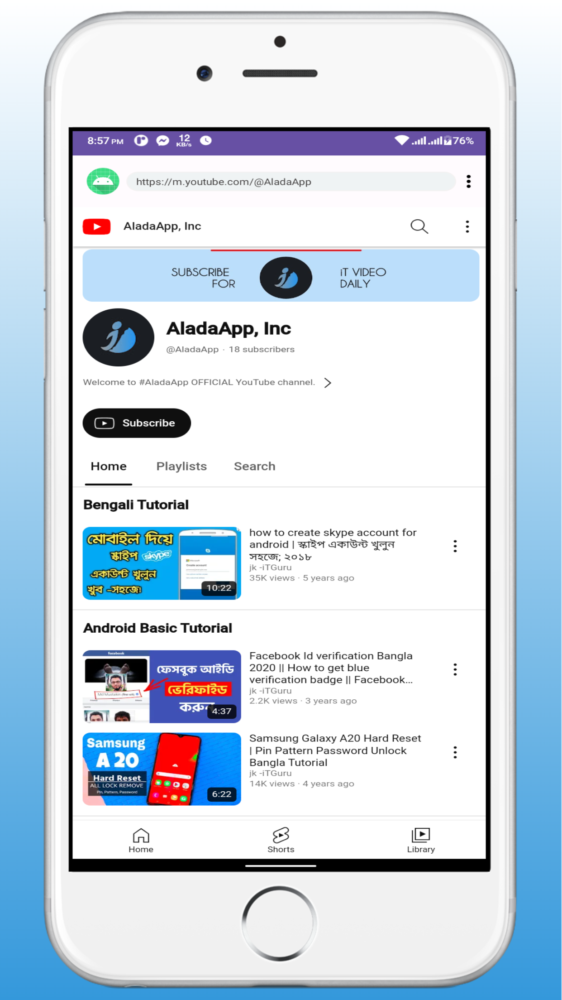 | 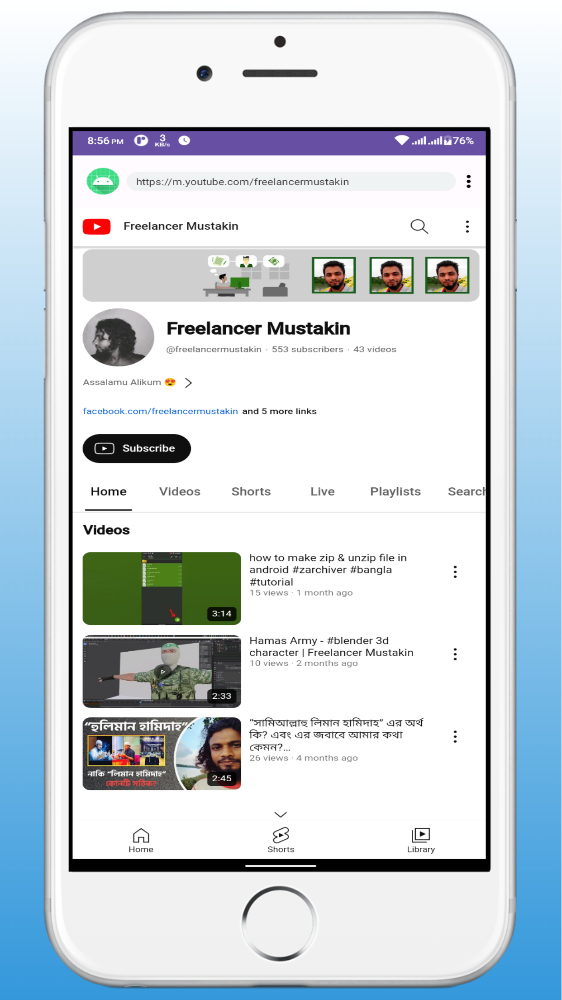 |  | 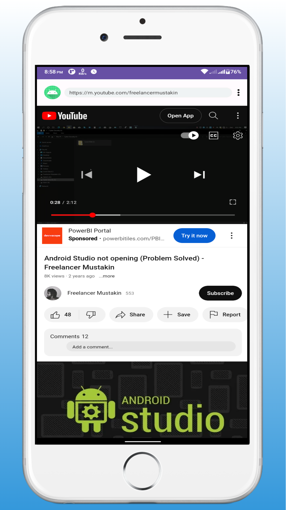 |
| 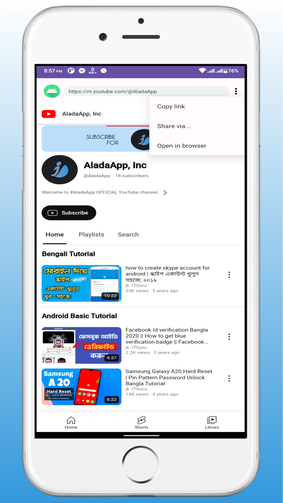 | 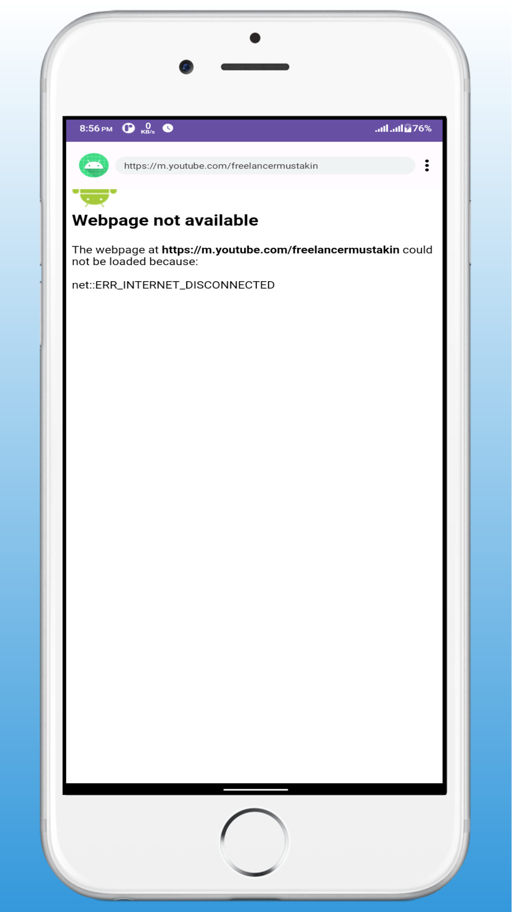 |  |  |  |


If you are not familiar with android studio or don’t know how to build and publish app. Ill help you with building and publishing app on play store. contact at

Join [Facebook](https://facebook.com/freelancermustakin) <br>
Join [Telegram](https://t.me/mustakin) <br>
Join [Telegram Channel](https://t.me/freelancermustakin) <br>
Join [YouTube](https://m.youtube.com/freelancermustakin) <br>
